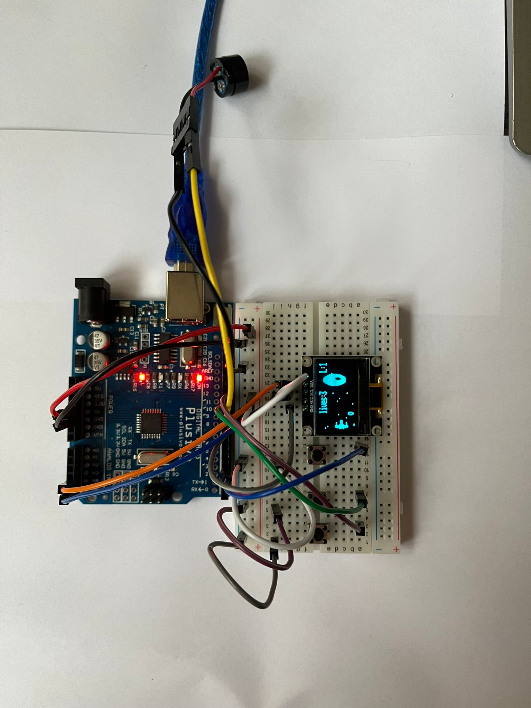

# Star-Wars
* This project is a Star Wars-themed shooting game made with an Arduino UNO. The player controls a spaceship using three buttons (up, down, fire) and fights against a computer-controlled enemy ship. The game is displayed on an OLED screen, and a buzzer sounds when the player loses all lives. The game then resets automatically.

  

  * **Hardware Functionality**
  * OLED Display (I2C) :  Displays the game interface the player’s spaceship, enemy ship, bullets, and score/lives
  * Push Buttons (x3) (Up Button: Moves the player’s spaceship up ; Down Button: Moves the spaceship down. ; Fire Button: Shoots projectiles at the enemy.)
  * Buzzer : Plays a sound when the player loses all lives .
  * Breadboard and Jumper Wires : Used to build the circuit and make connections between components and the Arduino

  * **Lab Functionalities**
  * GPIO (Lab 0): Used to read digital input from the three push buttons (up, down, fire), and to control the buzzer for sound effects.
  * I2C (Lab 6): Used to communicate with the OLED display that shows the game interface (spaceship, enemy, lives, shots).
  * Timers/Interrupts (Lab 2): Timers are used for game timing (enemy movement, shot delays), and interrupts are used to handle quick reactions (like firing or movement).

* **Functionalities and validations**
  * 1. setup()
  - Initializes hardware, game variables, and display for a smooth start.
  - Prepares input/output and sound systems for use by other functions.
  - Validated by checking hardware success and correct initial game state load.
  * 2. loop()
  - Continuously reads inputs, updates players, bullets, and enemies.
  - Calls resetGame() on game over and triggers beep() on events.
  - Validated through smooth gameplay flow, correct state changes and input responsiveness.
  * 3. resetGame() 
  - Resets scores, lives, and game objects to initial conditions.
  - Called from loop() to restart the game cleanly after game over.
  - Validated by confirming complete reset and fresh game start without leftover data.
  * 4. readVcc()
  - Reads system voltage silently during gameplay for display purposes.
  - Validated by cross-checking voltage readings and ensuring no impact on performance.
  * 5. beep()
  - Produces sound feedback on player actions and game events.
  - Called from loop() to sync audio with gameplay events.
  - Validated by confirming correct timing of sounds and no delays or interruptions caused.

  https://ocw.cs.pub.ro/courses/pm/prj2025/eradu/elena_diana.ghita?&#software_design

  Demo : https://youtu.be/Mx8T_nEwnMU?si=PSlvh532l-gZ7XPW
